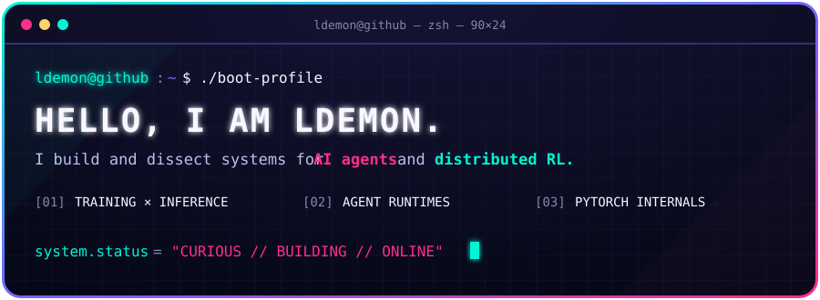

<div align="center">
  
</div>

<div align="center">
  <a href="https://github.com/ldemon2333?tab=repositories"></a>
  <a href="https://github.com/ldemon2333/Relax"></a>
  
</div>

```console
ldemon@github:~$ whoami
Distributed systems explorer · RL infrastructure builder · AI agent tinkerer

ldemon@github:~$ cat focus.txt
→ distributed reinforcement learning
→ agent runtimes and orchestration
→ training/inference systems
→ PyTorch internals
```

## `./featured --projects`

| Project | Signal |
| :-- | :-- |
| [**AgentOS**](https://github.com/ldemon2333/AgentOS) | Multi-agent orchestration platform |
| [**ai-agents-from-scratch**](https://github.com/ldemon2333/ai-agents-from-scratch) | Function calling, memory and ReAct without black boxes |
| [**BettaFish**](https://github.com/ldemon2333/BettaFish) | Multi-agent public-opinion analysis system |
| [**Relax**](https://github.com/ldemon2333/Relax) | Large-scale RL training systems experiments |

## `./stack --status=active`

<div align="center">
  
</div>

## `./telemetry --live`

<div align="center">
  <picture>
    <source media="(prefers-color-scheme: dark)" srcset="https://github-readme-stats.vercel.app/api?username=ldemon2333&show_icons=true&hide_border=true&bg_color=050816&title_color=00F5D4&icon_color=FF2E88&text_color=B8C1EC&ring_color=7B61FF" />
    
  </picture>
  <picture>
    <source media="(prefers-color-scheme: dark)" srcset="https://github-readme-stats.vercel.app/api/top-langs/?username=ldemon2333&layout=compact&hide_border=true&bg_color=050816&title_color=00F5D4&text_color=B8C1EC" />
    
  </picture>
</div>

<picture>
  <source media="(prefers-color-scheme: dark)" srcset="https://raw.githubusercontent.com/ldemon2333/ldemon2333/output/github-contribution-grid-snake-dark.svg" />
  <source media="(prefers-color-scheme: light)" srcset="https://raw.githubusercontent.com/ldemon2333/ldemon2333/output/github-contribution-grid-snake.svg" />
  
</picture>

```console
ldemon@github:~$ echo $STATUS
building systems, reading source, breaking abstractions

ldemon@github:~$ █
```
